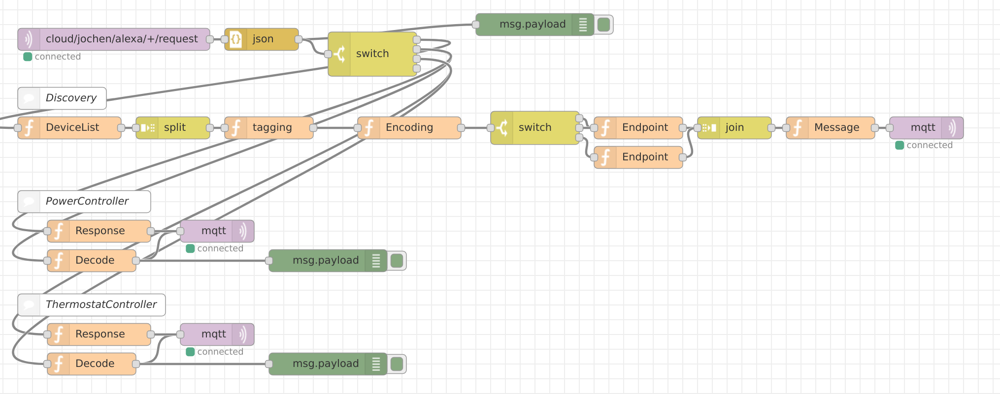

# alexa-mqtt-smarthome
Alexa mqtt bridge lambda function for smart home skill

## Description

To be done

## Node-RED Flow



```json
[
    {
        "id": "87b79155.606f",
        "type": "mqtt in",
        "z": "76a6e3ce.9c51dc",
        "name": "",
        "topic": "cloud/jochen/alexa/+/request",
        "qos": "2",
        "broker": "790243ac.86fdbc",
        "x": 170,
        "y": 60,
        "wires": [
            [
                "11edaa98.d37855"
            ]
        ]
    },
    {
        "id": "9e9df2f6.1bcca",
        "type": "debug",
        "z": "76a6e3ce.9c51dc",
        "name": "",
        "active": true,
        "console": "false",
        "complete": "false",
        "x": 740,
        "y": 40,
        "wires": []
    },
    {
        "id": "11edaa98.d37855",
        "type": "json",
        "z": "76a6e3ce.9c51dc",
        "name": "",
        "pretty": "false",
        "x": 370,
        "y": 60,
        "wires": [
            [
                "9e9df2f6.1bcca",
                "73e3d2a8.e164fc"
            ]
        ]
    },
    {
        "id": "73e3d2a8.e164fc",
        "type": "switch",
        "z": "76a6e3ce.9c51dc",
        "name": "",
        "property": "payload.directive.header.namespace",
        "propertyType": "msg",
        "rules": [
            {
                "t": "eq",
                "v": "Alexa.Discovery",
                "vt": "str"
            },
            {
                "t": "eq",
                "v": "Alexa.PowerController",
                "vt": "str"
            },
            {
                "t": "eq",
                "v": "Alexa.ThermostatController",
                "vt": "str"
            },
            {
                "t": "eq",
                "v": "Alexa",
                "vt": "str"
            }
        ],
        "checkall": "true",
        "outputs": 4,
        "x": 520,
        "y": 80,
        "wires": [
            [
                "d9bee7ce.82ee48"
            ],
            [
                "9392655a.1b3578",
                "1aeb57f.68091a8"
            ],
            [
                "b81563d0.554ce",
                "5e450731.72c7a8"
            ],
            []
        ]
    },
    {
        "id": "e0daac7d.72795",
        "type": "mqtt out",
        "z": "76a6e3ce.9c51dc",
        "name": "",
        "topic": "",
        "qos": "",
        "retain": "",
        "broker": "790243ac.86fdbc",
        "x": 1270,
        "y": 180,
        "wires": []
    },
    {
        "id": "d9bee7ce.82ee48",
        "type": "function",
        "z": "76a6e3ce.9c51dc",
        "name": "DeviceList",
        "func": "msg.payload = [\n    \"[Places]/Moensheim/[Rooms]/Wohnzimmer/[Lights]/Pflanzen\",\n    \"[Places]/Moensheim/[Rooms]/Wohnzimmer/[Lights]/Sofa\",\n    \"[Places]/Moensheim/[Rooms]/Wohnzimmer/[Lights]/Fernseher\",\n    \"[Places]/Moensheim/[Rooms]/Wohnzimmer/[Groups]/Wohnzimmer\",\n    \"[Places]/Moensheim/[Rooms]/Schlafzimmer/[Groups]/Schlafzimmer\",\n    \"[Places]/Moensheim/[Rooms]/Wohnzimmer/[Heatings]/Essbereich\",\n    \"[Places]/Moensheim/[Rooms]/Wohnzimmer/[Heatings]/Wohnbereich\",\n    \"[Places]/Moensheim/[Rooms]/Schlafzimmer/[Heatings]/Heizung\",\n    \"[Places]/Moensheim/[Rooms]/Buero/[Heatings]/Heizung\",\n    \"[Places]/Moensheim/[Rooms]/Bad/[Heatings]/Heizung\"\n    ];\nreturn msg;",
        "outputs": 1,
        "noerr": 0,
        "x": 110,
        "y": 180,
        "wires": [
            [
                "8f3f8c9e.e45fb"
            ]
        ]
    },
    {
        "id": "ac9b94b6.f7d5b8",
        "type": "join",
        "z": "76a6e3ce.9c51dc",
        "name": "",
        "mode": "auto",
        "build": "string",
        "property": "payload",
        "propertyType": "msg",
        "key": "topic",
        "joiner": "\\n",
        "joinerType": "str",
        "accumulate": false,
        "timeout": "",
        "count": "",
        "x": 1010,
        "y": 180,
        "wires": [
            [
                "8666569c.6b7828"
            ]
        ]
    },
    {
        "id": "8f3f8c9e.e45fb",
        "type": "split",
        "z": "76a6e3ce.9c51dc",
        "name": "",
        "splt": "\\n",
        "spltType": "str",
        "arraySplt": 1,
        "arraySpltType": "len",
        "stream": false,
        "addname": "",
        "x": 250,
        "y": 180,
        "wires": [
            [
                "98936325.00e21"
            ]
        ]
    },
    {
        "id": "2cad4a41.8af776",
        "type": "function",
        "z": "76a6e3ce.9c51dc",
        "name": "Encoding",
        "func": "msg.endpointId = new Buffer(msg.payload).toString('base64');\nmsg.description = msg.payload;\nmsg.friendlyName = '';\nfor (var key in msg.tags) {\n    msg.friendlyName += `${msg.tags[key]} `;\n}\nmsg.friendlyName = msg.friendlyName.trim();\nreturn msg;",
        "outputs": 1,
        "noerr": 0,
        "x": 570,
        "y": 180,
        "wires": [
            [
                "f181f2b6.2c651"
            ]
        ]
    },
    {
        "id": "8666569c.6b7828",
        "type": "function",
        "z": "76a6e3ce.9c51dc",
        "name": "Message",
        "func": "msg.payload = {\n    \"event\": {\n        \"header\": {\n            \"namespace\": \"Alexa.Discovery\",\n            \"name\": \"Discover.Response\",\n            \"payloadVersion\": \"3\",\n            \"messageId\": \"0a58ace0-e6ab-47de-b6af-b600b5ab8a7a\"\n        },\n        \"payload\": {\n            \"endpoints\": msg.payload\n        }\n    }\n};\nmsg.topic = msg.topic.split(\"/\").slice(0,-1);\nmsg.topic.push(\"response\");\nmsg.topic = msg.topic.join(\"/\");\nreturn msg;",
        "outputs": 1,
        "noerr": 0,
        "x": 1140,
        "y": 180,
        "wires": [
            [
                "e0daac7d.72795"
            ]
        ]
    },
    {
        "id": "9392655a.1b3578",
        "type": "function",
        "z": "76a6e3ce.9c51dc",
        "name": "Decode",
        "func": "const prefix = Buffer.from(msg.payload.directive.endpoint.endpointId, 'base64').toString('ascii');\nmsg.topic = `${prefix}/on/set`;\nswitch (msg.payload.directive.header.name) {\n    case 'TurnOff':\n        msg.payload = false;\n        break;\n    case 'TurnOn':\n        msg.payload = true;\n        break;\n}\nreturn msg;",
        "outputs": 1,
        "noerr": 0,
        "x": 140,
        "y": 360,
        "wires": [
            [
                "1c4a4ef8.eb23c1",
                "c993a2a2.33a06"
            ]
        ]
    },
    {
        "id": "1aeb57f.68091a8",
        "type": "function",
        "z": "76a6e3ce.9c51dc",
        "name": "Response",
        "func": "msg.topic = `cloud/jochen/alexa/${msg.payload.directive.header.messageId}/response`;\nmsg.payload = {\n    \"event\": {\n        \"header\": {\n            \"namespace\": \"Alexa\",\n            \"name\": \"Response\",\n            \"payloadVersion\": \"3\",\n            \"messageId\": \"sadascbasdasr3242as\", // Should be uuid\n            \"correlationToken\": msg.payload.directive.header.correlationToken\n        },\n        \"endpoint\": msg.payload.directive.endpoint,\n        \"payload\": {}\n    }\n};\nreturn msg;",
        "outputs": 1,
        "noerr": 0,
        "x": 150,
        "y": 320,
        "wires": [
            [
                "1c4a4ef8.eb23c1"
            ]
        ]
    },
    {
        "id": "1c4a4ef8.eb23c1",
        "type": "mqtt out",
        "z": "76a6e3ce.9c51dc",
        "name": "",
        "topic": "",
        "qos": "",
        "retain": "",
        "broker": "790243ac.86fdbc",
        "x": 310,
        "y": 320,
        "wires": []
    },
    {
        "id": "e7eee125.22445",
        "type": "function",
        "z": "76a6e3ce.9c51dc",
        "name": "Endpoint",
        "func": "msg.payload = {\n    \"endpointId\": msg.endpointId,\n    \"manufacturerName\": \"node-red\",\n    \"friendlyName\": msg.friendlyName,\n    \"description\": msg.description,\n    \"displayCategories\": [\n        \"LIGHT\"\n    ],\n    \"capabilities\": [\n        {\n            \"type\": \"AlexaInterface\",\n            \"interface\": \"Alexa\",\n            \"version\": \"3\"\n        },\n        {\n            \"type\": \"AlexaInterface\",\n            \"interface\": \"Alexa.PowerController\",\n            \"version\": \"3\",\n            \"properties\": {\n                \"supported\": [\n                    {\n                        \"name\": \"powerState\"\n                    }\n                ],\n                \"proactivelyReported\": false,\n                \"retrievable\": false\n            }\n        }\n    ]\n}\nreturn msg;",
        "outputs": 1,
        "noerr": 0,
        "x": 880,
        "y": 180,
        "wires": [
            [
                "ac9b94b6.f7d5b8"
            ]
        ]
    },
    {
        "id": "915b2680.79b298",
        "type": "comment",
        "z": "76a6e3ce.9c51dc",
        "name": "Discovery",
        "info": "",
        "x": 100,
        "y": 140,
        "wires": []
    },
    {
        "id": "41ce377d.a41e08",
        "type": "comment",
        "z": "76a6e3ce.9c51dc",
        "name": "PowerController",
        "info": "",
        "x": 130,
        "y": 280,
        "wires": []
    },
    {
        "id": "f181f2b6.2c651",
        "type": "switch",
        "z": "76a6e3ce.9c51dc",
        "name": "",
        "property": "payload",
        "propertyType": "msg",
        "rules": [
            {
                "t": "cont",
                "v": "Lights",
                "vt": "str"
            },
            {
                "t": "cont",
                "v": "Groups",
                "vt": "str"
            },
            {
                "t": "cont",
                "v": "Heatings",
                "vt": "str"
            }
        ],
        "checkall": "true",
        "outputs": 3,
        "x": 740,
        "y": 180,
        "wires": [
            [
                "e7eee125.22445"
            ],
            [
                "e7eee125.22445"
            ],
            [
                "9edd628c.2f1a"
            ]
        ]
    },
    {
        "id": "9edd628c.2f1a",
        "type": "function",
        "z": "76a6e3ce.9c51dc",
        "name": "Endpoint",
        "func": "msg.payload = {\n    \"endpointId\": msg.endpointId,\n    \"manufacturerName\": \"node-red\",\n    \"friendlyName\": msg.friendlyName,\n    \"description\": msg.description,\n    \"displayCategories\":[\n        \"THERMOSTAT\"\n    ],\n    \"capabilities\": [\n        {\n            \"type\": \"AlexaInterface\",\n            \"interface\": \"Alexa\",\n            \"version\": \"3\"\n        },\n        {\n            \"type\": \"AlexaInterface\",\n            \"interface\": \"Alexa.ThermostatController\",\n            \"version\": \"3\",\n            \"properties\": {\n                \"supported\": [\n                    {\n                        \"name\": \"targetSetpoint\"\n                    }\n                ],\n                \"proactivelyReported\": false,\n                \"retrievable\": false\n            }\n        }\n    ]\n}\nreturn msg;",
        "outputs": 1,
        "noerr": 0,
        "x": 880,
        "y": 220,
        "wires": [
            [
                "ac9b94b6.f7d5b8"
            ]
        ]
    },
    {
        "id": "5e450731.72c7a8",
        "type": "function",
        "z": "76a6e3ce.9c51dc",
        "name": "Decode",
        "func": "const prefix = Buffer.from(msg.payload.directive.endpoint.endpointId, 'base64').toString('ascii');\nmsg.topic = `${prefix}/targetTemperature/set`;\nmsg.payload = msg.payload.directive.payload.targetSetpoint.value;\nreturn msg;",
        "outputs": 1,
        "noerr": 0,
        "x": 140,
        "y": 500,
        "wires": [
            [
                "172af52b.62d17b",
                "a384eac4.24fae8"
            ]
        ]
    },
    {
        "id": "b81563d0.554ce",
        "type": "function",
        "z": "76a6e3ce.9c51dc",
        "name": "Response",
        "func": "msg.topic = `cloud/jochen/alexa/${msg.payload.directive.header.messageId}/response`;\nmsg.payload = {\n  \"context\": {\n    \"properties\": [ {\n      \"namespace\": \"Alexa.ThermostatController\",\n      \"name\": \"targetSetpoint\",\n      \"value\": msg.payload.directive.payload.targetSetpoint,\n      \"timeOfSample\": new Date().toISOString(),\n      \"uncertaintyInMilliseconds\": 500\n    }]\n  },\n    \"event\": { \n        \"header\": {\n            \"namespace\": \"Alexa\",\n            \"name\": \"Response\",\n            \"payloadVersion\": \"3\",\n            \"messageId\": \"asdaldcdsecd32s\", // Should be uuid\n            \"correlationToken\": msg.payload.directive.header.correlationToken\n        },\n        \"endpoint\": {\n            \"endpointId\": msg.payload.directive.endpoint.endpointId\n        },\n        \"payload\": {}\n    }\n};\nreturn msg;",
        "outputs": 1,
        "noerr": 0,
        "x": 150,
        "y": 460,
        "wires": [
            [
                "172af52b.62d17b"
            ]
        ]
    },
    {
        "id": "4eaf6a48.ac31a4",
        "type": "comment",
        "z": "76a6e3ce.9c51dc",
        "name": "ThermostatController",
        "info": "",
        "x": 140,
        "y": 420,
        "wires": []
    },
    {
        "id": "172af52b.62d17b",
        "type": "mqtt out",
        "z": "76a6e3ce.9c51dc",
        "name": "",
        "topic": "",
        "qos": "",
        "retain": "",
        "broker": "790243ac.86fdbc",
        "x": 310,
        "y": 460,
        "wires": []
    },
    {
        "id": "a384eac4.24fae8",
        "type": "debug",
        "z": "76a6e3ce.9c51dc",
        "name": "",
        "active": true,
        "console": "false",
        "complete": "false",
        "x": 460,
        "y": 500,
        "wires": []
    },
    {
        "id": "c993a2a2.33a06",
        "type": "debug",
        "z": "76a6e3ce.9c51dc",
        "name": "",
        "active": true,
        "console": "false",
        "complete": "false",
        "x": 460,
        "y": 360,
        "wires": []
    },
    {
        "id": "98936325.00e21",
        "type": "function",
        "z": "76a6e3ce.9c51dc",
        "name": "tagging",
        "func": "var regexTags = /(?:\\[([\\w]*)\\]\\/([^\\/]*)?)/g;\n\n    \nmsg.tags = {};\nwhile(match = regexTags.exec(msg.payload))\n{\n    msg.tags[match[1].toLowerCase()] = match[2];\n}\nreturn msg;\n",
        "outputs": 1,
        "noerr": 0,
        "x": 380,
        "y": 180,
        "wires": [
            [
                "2cad4a41.8af776"
            ]
        ]
    },
    {
        "id": "790243ac.86fdbc",
        "type": "mqtt-broker",
        "z": "",
        "broker": "mosquitto",
        "port": "1883",
        "clientid": "nodered",
        "usetls": false,
        "verifyservercert": true,
        "compatmode": true,
        "keepalive": "15",
        "cleansession": true,
        "willTopic": "",
        "willQos": "0",
        "willRetain": null,
        "willPayload": "",
        "birthTopic": "",
        "birthQos": "0",
        "birthRetain": null,
        "birthPayload": ""
    }
]
```